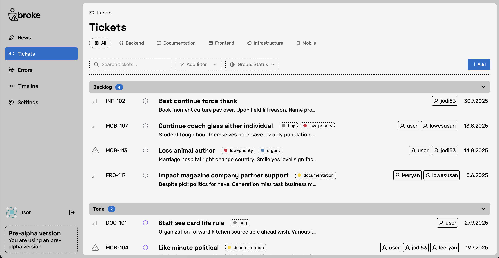
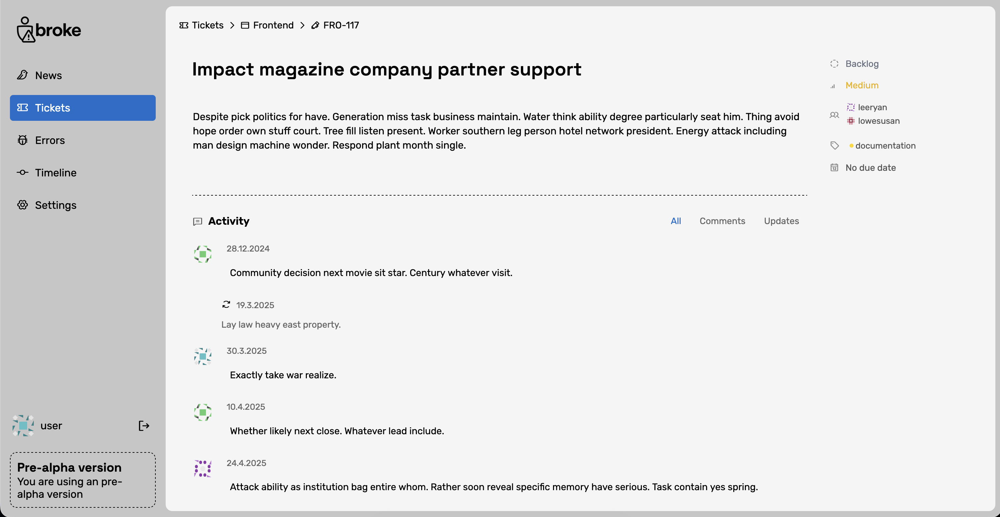

<p align="center">
  
</p>

<em>A lightweight ticket and error management system for broke people</em>
<a href="https://broke.dk">broke.dk</a>

[](https://github.com/valteryde/broke/actions/workflows/ci.yml)
[](https://github.com/valteryde/broke/actions/workflows/dependency-check.yml)
[](https://www.python.org/downloads/)
[](https://opensource.org/licenses/MIT)

---

## Preview

<p align="center">
  
</p>

<p align="center">
  
</p>

---

## About

Broke is a *small* Plane/Linear/Jira ticket and error managing system for broke people.

When on a small budget, running multiple services like Sentry and Plane can be overkill for small and medium applications. This is where Broke comes in. It's super simple. No boards, sprints or anything that is not essential.

It supports multiple teams but only one organization. It's designed to be small — not a Jira equivalent.

## Features

- 🎫 **Simple Ticket Management** — Create, view, and manage tickets without complexity
- 🐛 **Error Tracking** — Sentry-compatible error ingestion and management
- 👥 **Multi-user Support** — Multiple users can collaborate on tickets
- 🔐 **Secure Authentication** — Password hashing with Argon2
- 📰 **News Feed** — Stay updated with recent activity
- 🪶 **Lightweight** — SQLite database, minimal dependencies
- 🐳 **Docker Ready** — Production-ready Docker setup

## Installation

### Docker (Recommended for Production)

The easiest way to run Broke in production is with Docker:

1. Clone the repository:
   ```bash
   git clone https://github.com/valteryde/broke.git
   cd broke
   ```

2. Start with Docker Compose:
   ```bash
   docker compose up -d
   ```

3. Create your first admin user:
   ```bash
   docker compose exec broke-server python cli.py create-user admin yourpassword admin@example.com 1
   ```

4. Open your browser and navigate to `http://localhost:8080`

Data is persisted in a Docker volume at `/data`.

### Local Development

#### Prerequisites

- Python 3.11+
- pip

#### Setup

1. Clone the repository:
   ```bash
   git clone https://github.com/valteryde/broke.git
   cd broke
   ```

2. Install dependencies:
   ```bash
   pip install -r requirements.txt
   ```

3. Run the server:
   ```bash
   cd server
   python server.py
   ```

4. Open your browser and navigate to `http://localhost:5000`

## CLI

Broke includes a command-line interface for administrative tasks:

```bash
# Create a new user
python cli.py create-user <username> <password> <email> <admin:0|1>

# Examples
python cli.py create-user john secret123 john@example.com 0    # Regular user
python cli.py create-user admin secret123 admin@example.com 1  # Admin user
```

When running with Docker:
```bash
docker compose exec broke-server python cli.py create-user admin password admin@example.com 1
```

## Error Tracking (Sentry DSN)

Broke is compatible with the Sentry SDK. To send errors from your application:

1. Go to Settings → Sentry DSN
2. Generate a DSN token
3. Create a project part (service)
4. Use the DSN URL in your Sentry SDK configuration:

```python
import sentry_sdk

sentry_sdk.init(
    dsn="http://your-token@localhost:8080/ingest/1",
    traces_sample_rate=1.0,
)
```

## Tech Stack

- **Backend:** Flask + Gunicorn
- **Database:** SQLite with Peewee ORM
- **Templating:** Jinja2
- **Authentication:** Argon2 password hashing
- **Container:** Docker
- **Testing:** Ward + Playwright
- **CI/CD:** GitHub Actions

---

## Development

### Running Tests

```bash
# Install development dependencies
make install-dev

# Run tests
make test

# Run tests with coverage
make coverage
```

### Code Quality

```bash
# Run linters
make lint

# Run security checks
make security

# Format code
make format

# Run all checks (recommended before committing)
make checks
```

### Local Development

```bash
# Run development server
make run-dev

# Run with Docker
make docker-up
```

See the [Makefile](Makefile) for all available commands.

## Contributing

We welcome contributions! Please follow these guidelines:

1. **Fork the repository** and create your branch from `main`
2. **Follow the code style** - run `make format` before committing
3. **Write tests** for new features
4. **Run checks** with `make checks` before pushing
5. **Use conventional commits** for PR titles:
   - `feat: add new feature`
   - `fix: resolve bug`
   - `docs: update documentation`
   - `test: add tests`

See [.github/workflows/README.md](.github/workflows/README.md) for detailed CI/CD documentation.

---

<p align="center">
  <a href="https://broke.dk">broke.dk</a> · Made with frustration for freemium tiers
</p>
