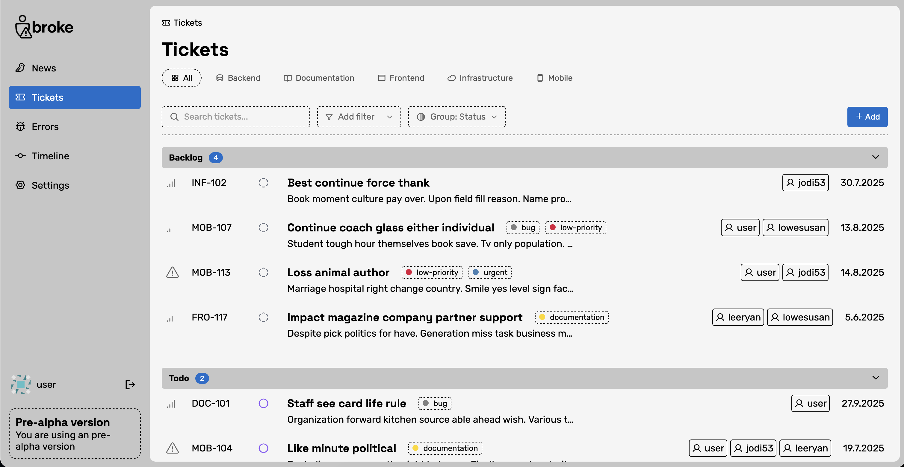
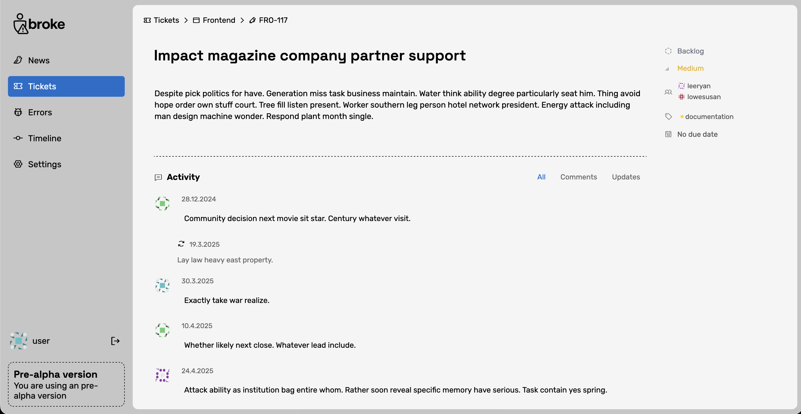

<p align="center">
  
</p>

<em>An open-source, self-hosted ticket and error management system for broke people</em>
<a href="https://broke.dk">broke.dk</a>

[](https://github.com/valteryde/broke/actions/workflows/ci.yml)
[](https://github.com/valteryde/broke/actions/workflows/dependency-check.yml)
[](https://www.python.org/downloads/)
[](https://opensource.org/licenses/MIT)

---

## Preview

<p align="center">
  
</p>

<p align="center">
  
</p>

---

## About

Broke is a small open-source alternative to tools like Plane, Linear, Jira, and Sentry for teams that want one simple place for tickets and errors.

When running on a tight budget, using multiple services can be overkill. Broke keeps core workflow in one product: ticketing, intake, and error tracking.

It supports multiple teams but only one organization. It's designed to be small — not a Jira equivalent.

## Features

- **Simple Ticket Management** — Create, view, and manage tickets without complexity
- **Kanban + List Views** — Work the way your team prefers
- **Subtickets** — Break larger work into smaller linked items
- **Intake Inbox** — Route incoming issues before they hit active work
- **Optional AI-Assisted Intake** — Draft and route tickets faster when AI settings are configured
- **Error Tracking** — Sentry-compatible error ingestion and management
- **Server Metrics** — Telegraf agents push host metrics over the InfluxDB write API
- **Multi-user Support** — Multiple users can collaborate on tickets
- **Reports + Timeline** — Activity and operational insights in one place
- **Secure Authentication** — Password hashing with Argon2
- **News Feed** — Stay updated with recent activity
- **Lightweight** — SQLite database, minimal dependencies
- **Docker Ready** — Production-ready Docker setup

## Installation

### Docker (Recommended for Production)

The easiest way to run Broke in production is with Docker:

1. Clone the repository:
   ```bash
   git clone https://github.com/valteryde/broke.git
   cd broke
   ```

2. Start with Docker Compose:
   ```bash
   docker compose up -d
   ```

3. Create your first admin user:
   ```bash
   docker compose exec broke-server python app/cli.py create-user admin yourpassword admin@example.com --admin 1
   ```

> **Note:** CLI examples use `python app/cli.py` inside the container (`WORKDIR` is `/usr/local/app`).

4. Open your browser and navigate to `http://localhost:8080`

Data is persisted in a Docker volume at `/data`.

### Local Development

#### Prerequisites

- Python 3.11+
- pip

#### Setup

1. Clone the repository:
   ```bash
   git clone https://github.com/valteryde/broke.git
   cd broke
   ```

2. Install dependencies:
   ```bash
   pip install -r requirements.txt
   ```

3. Run the server:
   ```bash
   cd server
   python server.py
   ```

4. Open your browser and navigate to `http://localhost:5000`

## CLI

Broke includes a command-line interface for administrative tasks. From the repository root (with dependencies installed), run commands via `app/cli.py`. The first argument after `create-user` is `--admin 0` or `--admin 1`.

```bash
# Create a new user
python app/cli.py create-user <username> <password> <email> --admin <0|1>

# Examples
python app/cli.py create-user john secret123 john@example.com --admin 0   # Regular user
python app/cli.py create-user admin secret123 admin@example.com --admin 1 # Admin user

# Full backup of all on-disk data (SQLite, uploads, branding, avatars, webhook secret files, etc.)
python app/cli.py export -o ./broke-backup.tar.gz

# Restore from an export (merge: overwrites paths that exist in the archive only)
python app/cli.py restore ./broke-backup.tar.gz

# Replace the entire data directory with the archive (typical for a clean migration)
python app/cli.py restore ./broke-backup.tar.gz --wipe --force
```

When running with Docker, stop the service first if you need a consistent database snapshot, then export (writes the archive wherever you pass `-o`; using `/data/…` puts the file in the volume so you can copy it off the host):

```bash
docker compose stop broke-server
docker compose run --rm --no-deps -v data:/data broke-server python app/cli.py export -o /data/broke-export.tar.gz
docker compose start broke-server
```

To restore on the new server (stop Broke first; use `--wipe` on a fresh data dir to match the old instance exactly):

```bash
docker compose stop broke-server
docker compose run --rm --no-deps -v data:/data broke-server python app/cli.py restore /data/broke-export.tar.gz --wipe --force
docker compose start broke-server
```

`--force` skips the interactive confirmation (required in CI and non-TTY shells). Without `--wipe`, files already on disk that are **not** in the archive are left as-is. Redis is not part of the export; users may need to sign in again.

When running with Docker (quick admin commands while the stack is up):

```bash
docker compose exec broke-server python app/cli.py create-user admin password admin@example.com --admin 1
```

## Error Tracking (Sentry DSN)

Broke is compatible with the Sentry SDK. To send errors from your application:

1. Go to Settings → Sentry DSN
2. Generate a DSN token
3. Create a part (service) on the Errors page — parts are not tied to ticket projects
4. Use the DSN URL in your Sentry SDK configuration:

```python
import sentry_sdk

sentry_sdk.init(
    dsn="http://your-token@localhost:8080/ingest/1",
    traces_sample_rate=1.0,
)
```

## Server Metrics (Telegraf)

Broke implements the InfluxDB write API, so any server running
[Telegraf](https://github.com/influxdata/telegraf) can push its metrics without a plugin
or a separate time-series database.

1. Go to Settings → Server Metrics and create a token. Create one per server so a single
   compromised host can be revoked on its own.
2. Add the output to `/etc/telegraf/telegraf.conf` on that server:

```toml
[[outputs.influxdb_v2]]
  urls = ["https://broke.example.com"]
  token = "<your metrics token>"
  organization = "broke"
  bucket = "broke"
```

3. Restart Telegraf. The host appears under **Servers** within a minute.

Use the `https://` URL. A TLS-terminating proxy answers an `http://` write with a
`308 Permanent Redirect`, which Telegraf does not follow — it logs
`E! [outputs.influxdb_v2] ... 308 Permanent Redirect` and drops the batch — and the token
has already crossed the network in clear text by then. The snippet in Settings → Server
Metrics fills this in for you; if Broke cannot see its own public origin behind your proxy,
set `APP_BASE_URL` to it.

The older `[[outputs.influxdb]]` plugin works too — point it at the same URL and pass the
token as the `password` field, which it sends as basic auth. Passing the token in the URL
as `?p=` is refused unless you set `METRICS_ALLOW_QUERY_TOKEN=1`, since query strings end
up in access logs.

Whatever Telegraf sends is stored, and the charts come from that rather than a fixed list,
so a host running an unusual plugin is charted just as well as a stock one.

The first time you open a server, Broke picks a board from the data itself: at most one
field per measurement, favouring series whose value actually moved over ones sitting at a
constant, and skipping string fields as unplottable. Nothing is written to the database at
this point, so the suggestion keeps up as the agent starts or stops sending things.

**Edit charts** replaces that with your own selection — tick the series you want, drag to
reorder, and save. A saved board is shared by everyone looking at that server, and
**Reset to suggested** discards it and returns to the automatic picks. The measurement
explorer below the board still charts any single field ad hoc without changing the board.

### How metrics are stored

Recent points land in `metrics.db`, a SQLite file kept separate from `app.db` so a burst
of metrics can never block a ticket write. Every few minutes a background task compacts
anything older than an hour into ZSTD-compressed Parquet under `metrics/dt=<date>/<host>/`,
which DuckDB reads back when drawing charts. Compression works out to roughly 4 MB per
host per day, so a year of full-resolution history is practical. Everything lives under
your data volume, so the existing backup covers it.

| Variable | Default | Purpose |
|----------|---------|---------|
| `METRICS_RETENTION_DAYS` | `365` | How long Parquet day partitions are kept |
| `METRICS_MAX_SERIES_PER_HOST` | `5000` | Cardinality cap; stops a misconfigured agent flooding the lake |
| `METRICS_HOT_WINDOW_SECONDS` | `3600` | How much recent data stays in SQLite before compaction |
| `METRICS_COMPACT_INTERVAL_SECONDS` | `300` | How often the compaction sweep runs |
| `METRICS_COMPACTION_IN_PROCESS` | `1` | Set to `0` to compact in a separate `python -m app.metrics_worker` process |
| `METRICS_ALLOW_QUERY_TOKEN` | `0` | Set to `1` to let legacy v1 clients pass the token as `?p=`. Off by default because a query string is recorded by every proxy access log it passes |

Set `BROKE_DISABLED_FEATURES=metrics` to remove the ingest endpoints and the Servers page
entirely.

## Email Service (SMTP)

Password reset emails require SMTP configuration.

### Configure from the UI (recommended)

1. Sign in as an admin user.
2. Go to `Settings -> Email Service`.
3. Fill in SMTP host, port, username/password, sender address, and TLS preference.
4. Save settings.

These values are stored in app settings and used automatically by the password reset flow.

### Configure from environment variables (optional)

You can also configure SMTP via environment variables:

- `SMTP_HOST`
- `SMTP_PORT`
- `SMTP_USER`
- `SMTP_PASSWORD`
- `SMTP_FROM`

UI-saved SMTP settings take precedence over environment variables when present.

## Tech Stack

- **Backend:** Flask + Gunicorn
- **Database:** SQLite with Peewee ORM
- **Metrics storage:** Parquet lake queried with DuckDB
- **Metrics charts:** uPlot, vendored under `app/static/js/vendor` so charts work offline
- **Templating:** Jinja2
- **Authentication:** Argon2 password hashing
- **Container:** Docker
- **Testing:** Ward + Playwright
- **CI/CD:** GitHub Actions

---

## Development

### Running Tests

```bash
# Install development dependencies
make install-dev

# Run tests
make test

# Run tests with coverage
make coverage
```

### Code Quality

```bash
# Run linters
make lint

# Run security checks
make security

# Format code
make format

# Run all checks (recommended before committing)
make checks
```

### Local Development

```bash
# Run development server
make run-dev

# Run with Docker
make docker-up
```

See the [Makefile](Makefile) for all available commands.

## Contributing

We welcome contributions! Please follow these guidelines:

1. **Fork the repository** and create your branch from `main`
2. **Follow the code style** - run `make format` before committing
3. **Write tests** for new features
4. **Run checks** with `make checks` before pushing
5. **Use conventional commits** for PR titles:
   - `feat: add new feature`
   - `fix: resolve bug`
   - `docs: update documentation`
   - `test: add tests`

See [.github/workflows/README.md](.github/workflows/README.md) for detailed CI/CD documentation.

---

<p align="center">
  <a href="https://broke.dk">broke.dk</a> · Made with frustration for freemium tiers
</p>
